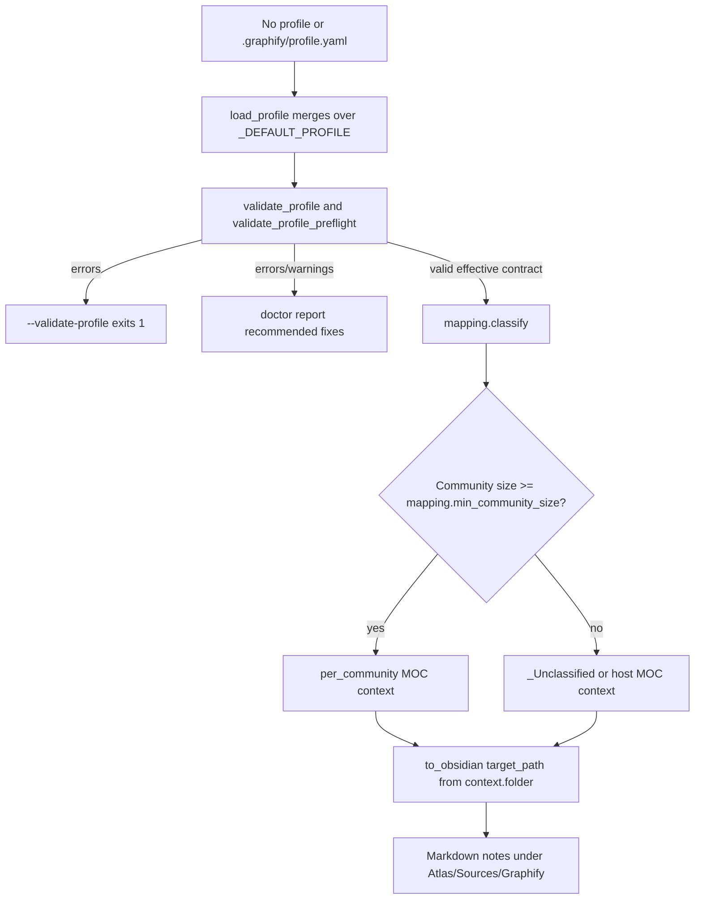

# Phase 32: Profile Contract & Defaults - Research

**Researched:** 2026-04-28  
**Domain:** Obsidian vault profile schema, default taxonomy, validation/preflight, and mapping contract  
**Confidence:** HIGH

<user_constraints>
## User Constraints (from CONTEXT.md)

### Locked Decisions

### Default Taxonomy Shape
- **D-01:** All generated Obsidian notes produced by the built-in/default profile must live under the Graphify-owned subtree `Atlas/Sources/Graphify/`.
- **D-02:** Concept MOCs must live under `Atlas/Sources/Graphify/MOCs/`.
- **D-03:** Default non-MOC generated notes should use typed subfolders under `Atlas/Sources/Graphify/`, such as `Things/`, `Statements/`, `People/`, and `Sources/`.
- **D-04:** The v1.8 default taxonomy covers Markdown vault notes only. Manifests, dry-run artifacts, audit files, and other non-note artifacts keep existing `graphify-out` behavior in this phase.
- **D-05:** Built-in bucket names should be explicit and stable: `Graphify`, `MOCs`, and `_Unclassified`, while still respecting previously established naming standards.

### Profile Contract Keys
- **D-06:** Use `mapping.min_community_size` as the canonical profile key for the cluster-quality floor.
- **D-07:** Existing requirement wording that says `clustering.min_community_size` must be revised to `mapping.min_community_size`.
- **D-08:** Add a top-level `taxonomy:` block for v1.8 taxonomy version/default folder semantics.
- **D-09:** Profiles that explicitly request deprecated community overview output should produce hard-deprecated warnings in Phase 32, not fatal errors yet.
- **D-10:** New v1.8 defaults should live directly in `_DEFAULT_PROFILE` so `load_profile()`, `validate_profile()`, preflight, and doctor all see the same contract.

### Validation Severity And Messages
- **D-11:** Unsupported `taxonomy:` keys and malformed taxonomy folder entries are validation errors. They should fail `--validate-profile` to prevent silent misrouting.
- **D-12:** Deprecated community overview warnings should name the deprecated setting/template and point users toward MOC-only output plus migration guidance.
- **D-13:** `mapping.moc_threshold` is invalid immediately in v1.8. Users must migrate to `mapping.min_community_size`.
- **D-14:** Update requirements/traceability to reflect the immediate `mapping.moc_threshold` break instead of preserving CLUST-04's current legacy-precedence wording.
- **D-15:** v1.8 validation findings should surface through both `graphify --validate-profile` and `graphify doctor`, sharing the same validator/preflight source.

### Compatibility And Precedence
- **D-16:** If `taxonomy:` and explicit `folder_mapping` both define folder placement, `taxonomy:` wins.
- **D-17:** Existing user profiles that do not add the new `taxonomy:` or `mapping.min_community_size` keys should fail validation. Backward compatibility is not required for this branch because there is no active profile being used now.
- **D-18:** Update all v1.8 requirement and roadmap references during Phase 32 so later phases inherit the new contract.

### Folded Todos
- **D-19:** Fold `.planning/todos/pending/fix-ls-vault-profile-routing.md` into this phase. The no-profile/default contract must ensure Obsidian/vault note output does not dump generated notes into the vault root; default vault note paths should use the Graphify-owned subtree.

### Claude's Discretion
- **D-20:** For non-vault runs, preserve prior output behavior unless implementation research shows it conflicts with the v1.8 contract. The no-root guarantee applies to Obsidian/vault note output.

### Deferred Ideas (OUT OF SCOPE)
None - discussion stayed within phase scope.
</user_constraints>

<phase_requirements>
## Phase Requirements

| ID | Description | Research Support |
|----|-------------|------------------|
| TAX-01 | User can run graphify with no vault profile and receive generated notes under a Graphify-owned default subtree. | `_DEFAULT_PROFILE.folder_mapping` is the no-profile source of truth used by `load_profile()` and `to_obsidian()` when no profile is supplied. [VERIFIED: `graphify/profile.py`, `graphify/export.py`] |
| TAX-02 | User can find default concept MOCs under `Atlas/Sources/Graphify/MOCs/`. | MOC folders currently come from `folder_mapping.moc`; Phase 32 should move the default value to `Atlas/Sources/Graphify/MOCs/` and make taxonomy precedence feed the same classification context. [VERIFIED: `graphify/profile.py`, `graphify/mapping.py`] |
| TAX-03 | User-authored vault profiles continue to override default folder placement without requiring profile rewrites. | CONTEXT.md revises this: user profiles without `taxonomy:` or `mapping.min_community_size` should fail validation, but profiles with valid taxonomy should override defaults. [VERIFIED: `32-CONTEXT.md`] |
| TAX-04 | User can validate a v1.8 profile and see actionable errors for unsupported taxonomy keys or invalid folder mappings. | `validate_profile()` already accumulates schema errors; add taxonomy and legacy-key checks there, then surface through preflight and CLI. [VERIFIED: `graphify/profile.py`, `graphify/__main__.py`] |
| COMM-03 | User receives targeted guidance when an existing custom profile or template requests hard-deprecated community overview output. | `community` remains a known note/template type; Phase 32 should warn on profile/template use without deleting render support yet. [VERIFIED: `graphify/templates.py`] |
| CLUST-01 | User can set `mapping.min_community_size` in the vault profile to control standalone MOC generation. | CONTEXT.md replaces old `clustering.min_community_size`; `_assemble_communities()` currently reads `mapping.moc_threshold` and must switch to `mapping.min_community_size`. [VERIFIED: `32-CONTEXT.md`, `graphify/mapping.py`] |
| CLUST-04 | User receives deterministic behavior when legacy and new keys are both present. | CONTEXT.md revises this: `mapping.moc_threshold` is invalid immediately, so deterministic behavior is a validation error, not precedence. [VERIFIED: `32-CONTEXT.md`, `.planning/REQUIREMENTS.md`] |
</phase_requirements>

## Summary

Phase 32 should be planned as a schema/contract phase, not as full rendering/migration implementation. The key implementation move is to make `_DEFAULT_PROFILE` carry the v1.8 contract (`taxonomy:` plus `mapping.min_community_size`) and make the existing shared validation/preflight paths reject invalid or legacy profile shapes before later phases depend on them. [VERIFIED: `32-CONTEXT.md`, `graphify/profile.py`]

The main reconciliation risk is that `.planning/REQUIREMENTS.md`, `.planning/ROADMAP.md`, and the folded todo still describe the older contract: `clustering.min_community_size`, new-key-precedence over `mapping.moc_threshold`, and default output leakage through legacy `folder_mapping`. Phase 32 must update those planning artifacts in the same implementation wave as code/tests so Phase 33-36 do not inherit contradictory requirements. [VERIFIED: `.planning/REQUIREMENTS.md`, `.planning/ROADMAP.md`, `.planning/todos/pending/fix-ls-vault-profile-routing.md`]

**Primary recommendation:** Implement one shared v1.8 profile contract in `graphify/profile.py`, consume it in `graphify/mapping.py`, and have both `--validate-profile` and `doctor` report the same errors/warnings from `validate_profile_preflight()`. [VERIFIED: `graphify/profile.py`, `graphify/mapping.py`, `graphify/doctor.py`, `graphify/__main__.py`]

## Project Constraints (from .cursor/rules/)

- No repo-local `.cursor/rules/` files exist, so there are no additional project-specific Cursor rule directives to apply. [VERIFIED: Glob `.cursor/rules/**` returned 0 files]
- No repo-local `.claude/skills/` or `.agents/skills/` project skills exist, so Phase 32 planning should rely on `CLAUDE.md` and `.planning/` context. [VERIFIED: Glob `.claude/skills/**/SKILL.md` and `.agents/skills/**/SKILL.md` returned 0 files]
- `CLAUDE.md` requires Python 3.10+ compatibility, no new required dependencies, pure unit tests with no network calls, and path/input validation through existing security/profile helpers. [VERIFIED: `CLAUDE.md`]

## Architectural Responsibility Map

| Capability | Primary Tier | Secondary Tier | Rationale |
|------------|--------------|----------------|-----------|
| Profile default contract | Profile schema layer | Mapping/export layer | `_DEFAULT_PROFILE` is already merged by `load_profile()` and consumed downstream by mapping/export. [VERIFIED: `graphify/profile.py`, `graphify/export.py`] |
| Taxonomy folder semantics | Profile schema layer | Mapping layer | Taxonomy must win over `folder_mapping`, so the resolved profile should expose deterministic folder placement before classification/rendering. [VERIFIED: `32-CONTEXT.md`, `graphify/mapping.py`] |
| Community size floor | Mapping layer | Profile schema layer | `mapping.py::_assemble_communities()` makes the MOC/bucket decision, while profile validation owns the key shape. [VERIFIED: `graphify/mapping.py`, `graphify/profile.py`] |
| Validation/preflight UX | Profile validation layer | CLI/doctor surfaces | `--validate-profile` already calls `validate_profile_preflight()`; doctor should use the same source rather than calling only `validate_profile(load_profile())`. [VERIFIED: `graphify/__main__.py`, `graphify/doctor.py`] |
| Planning-artifact reconciliation | Planning docs | Code/test plan | CONTEXT.md explicitly requires requirement/roadmap wording updates during Phase 32. [VERIFIED: `32-CONTEXT.md`] |

## Standard Stack

### Core

| Library | Version | Purpose | Why Standard |
|---------|---------|---------|--------------|
| Python | 3.10.19 available locally; project requires >=3.10 | Implement profile/mapping/doctor changes | Repo and CI target Python 3.10/3.12. [VERIFIED: `python3 --version`, `pyproject.toml`, `CLAUDE.md`] |
| NetworkX | 3.4.2 installed; unpinned dependency | Existing graph and community data structure | `mapping.classify()` and `to_obsidian()` operate on `nx.Graph`. [VERIFIED: `python3 importlib.metadata`, `graphify/mapping.py`, `pyproject.toml`] |
| PyYAML | 6.0.3 installed; optional `obsidian`/`routing` extra | Parse vault-side `profile.yaml` | Existing loader imports `yaml` lazily and falls back when unavailable. [VERIFIED: `python3 importlib.metadata`, `graphify/profile.py`, `pyproject.toml`] |
| pytest | 9.0.3 available locally | Unit/regression validation | Repo test convention is pytest under `tests/`. [VERIFIED: `pytest --version`, `CLAUDE.md`] |

### Supporting

| Library | Version | Purpose | When to Use |
|---------|---------|---------|-------------|
| Standard library `pathlib`, `string.Template`, `dataclasses`, `typing` | Python 3.10 stdlib | Path confinement, simple templates, typed result containers | Continue the existing no-new-required-dependencies approach. [VERIFIED: `graphify/profile.py`, `graphify/templates.py`, `graphify/doctor.py`] |

### Alternatives Considered

| Instead of | Could Use | Tradeoff |
|------------|-----------|----------|
| Existing profile validator | JSON Schema or Pydantic | Would add new required dependency or a parallel schema surface; current project explicitly avoids new required dependencies. [VERIFIED: `CLAUDE.md`, `pyproject.toml`] |
| Existing `string.Template` template validation | Jinja2 | Out of scope and contradicts existing template-engine constraint. [VERIFIED: `CLAUDE.md`, `graphify/templates.py`] |

**Installation:** No new package install should be planned for Phase 32. Existing local environment has Python, pytest, NetworkX, and PyYAML available. [VERIFIED: shell environment probe]

**Version verification:** Package versions were checked with `python3 --version`, `pytest --version`, and `importlib.metadata` for `networkx` and `PyYAML`. Publish dates were not checked because Phase 32 should not introduce new external packages. [VERIFIED: shell environment probe]

## Architecture Patterns

### System Architecture Diagram



### Recommended Project Structure

```text
graphify/
├── profile.py        # v1.8 default taxonomy, schema validation, shared preflight
├── mapping.py        # consume mapping.min_community_size and taxonomy-derived folders
├── doctor.py         # report validate_profile_preflight errors/warnings and fix hints
├── templates.py      # detect/warn on community overview template contract, keep rendering support
├── __main__.py       # --validate-profile output stays thin over preflight
└── export.py         # no broad refactor; consume mapping contexts already produced

tests/
├── test_profile.py   # default contract, taxonomy schema, legacy key invalidation, CLI preflight
├── test_mapping.py   # min_community_size behavior and _Unclassified naming/folder context
├── test_doctor.py    # shared warning/error surfacing and recommended fixes
└── test_export.py    # no-profile default dry-run/write target paths under Graphify subtree
```

### Pattern 1: Profile Contract Is Atomic

**What:** Add every new profile key in the same change set: `_DEFAULT_PROFILE`, `_VALID_TOP_LEVEL_KEYS`, `validate_profile()`, `validate_profile_preflight()`, and tests. [VERIFIED: `32-CONTEXT.md`, `graphify/profile.py`, `tests/test_profile.py`]  
**When to use:** Any profile schema/default change. [VERIFIED: `32-CONTEXT.md`]  
**Example:**

```python
# Source: graphify/profile.py
_DEFAULT_PROFILE = {
    "folder_mapping": {...},
    "mapping": {"moc_threshold": 3},
}

_VALID_TOP_LEVEL_KEYS = {
    "folder_mapping", "mapping", ...
}

def validate_profile(profile: dict) -> list[str]:
    errors: list[str] = []
    ...
    return errors
```

### Pattern 2: Validator Accumulates Actionable Findings

**What:** Validation returns lists of strings instead of raising for ordinary profile mistakes. [VERIFIED: `graphify/profile.py`]  
**When to use:** Unsupported `taxonomy:` keys, malformed folder entries, invalid legacy `mapping.moc_threshold`, missing required v1.8 keys, and community overview deprecation warnings. [VERIFIED: `32-CONTEXT.md`]  
**Example:**

```python
# Source: graphify/profile.py
errors: list[str] = []
for key in profile:
    if key not in _VALID_TOP_LEVEL_KEYS:
        errors.append(f"Unknown profile key '{key}' ...")
return errors
```

### Pattern 3: Classification Owns Community Routing

**What:** `_assemble_communities()` is the only current place deciding which communities become standalone MOCs versus bucket/hosted sub-communities. [VERIFIED: `graphify/mapping.py`]  
**When to use:** Replace `mapping.moc_threshold` with `mapping.min_community_size`; do not implement the cluster-quality floor in rendering. [VERIFIED: `graphify/mapping.py`, `32-CONTEXT.md`]  
**Example:**

```python
# Source: graphify/mapping.py
raw_threshold = profile.get("mapping", {}).get("moc_threshold", 3)
above_cids = sorted(
    cid for cid, members in communities.items() if len(members) >= threshold
)
```

### Pattern 4: Doctor Should Share Preflight

**What:** `--validate-profile` already calls `validate_profile_preflight()`, while `doctor` currently calls `load_profile()` followed by `validate_profile()`. [VERIFIED: `graphify/__main__.py`, `graphify/doctor.py`]  
**When to use:** Plan a small refactor so doctor surfaces v1.8 preflight warnings and errors from the same source as CLI validation. [VERIFIED: `32-CONTEXT.md`]  
**Example:**

```python
# Source: graphify/__main__.py
result = validate_profile_preflight(vault_arg)
for err in result.errors:
    print(f"error: {err}", file=sys.stderr)
for warn in result.warnings:
    print(f"warning: {warn}", file=sys.stderr)
```

### Anti-Patterns to Avoid

- **Preserving `mapping.moc_threshold` as an alias:** CONTEXT.md says it is invalid immediately; an alias would contradict D-13/D-14. [VERIFIED: `32-CONTEXT.md`]
- **Adding `clustering.min_community_size`:** CONTEXT.md says canonical key is `mapping.min_community_size`; requirements/roadmap must be corrected. [VERIFIED: `32-CONTEXT.md`, `.planning/REQUIREMENTS.md`, `.planning/ROADMAP.md`]
- **Putting taxonomy precedence in templates:** Templates consume `ClassificationContext.folder`; routing decisions belong before rendering. [VERIFIED: `graphify/mapping.py`, `graphify/templates.py`]
- **Letting `doctor` call a different validation path:** D-15 requires shared validator/preflight source. [VERIFIED: `32-CONTEXT.md`, `graphify/doctor.py`]

## Don't Hand-Roll

| Problem | Don't Build | Use Instead | Why |
|---------|-------------|-------------|-----|
| YAML/profile parsing | Custom YAML parser | Existing lazy PyYAML path in `profile.py` | Already handles optional dependency fallback and composition resolver. [VERIFIED: `graphify/profile.py`] |
| Profile schema engine | New JSON Schema/Pydantic layer | Existing `validate_profile()` error-list pattern | Avoids new dependency and duplicate schema truth. [VERIFIED: `CLAUDE.md`, `graphify/profile.py`] |
| Path safety | Ad hoc string filtering at export time | `validate_vault_path()` and existing folder validators | Existing helpers already reject traversal, absolute paths, and `~`. [VERIFIED: `graphify/profile.py`, `graphify/mapping.py`] |
| Community routing | Rendering-time filters | `mapping.classify()` / `_assemble_communities()` | Existing classification contexts already drive `to_obsidian()` paths and note type. [VERIFIED: `graphify/mapping.py`, `graphify/export.py`] |
| Doctor output formatting | Separate v1.8 formatter | Existing `DoctorReport`, `_FIX_HINTS`, `format_report()` | Keeps output section order and `[graphify]` prefix contract. [VERIFIED: `graphify/doctor.py`, `tests/test_doctor.py`] |

**Key insight:** Phase 32 is mostly about moving truth earlier in the pipeline; once defaults and validation are correct, later export/render phases can consume a stable contract instead of patching path behavior after the fact. [VERIFIED: `32-CONTEXT.md`, `graphify/export.py`]

## Runtime State Inventory

| Category | Items Found | Action Required |
|----------|-------------|-----------------|
| Stored data | None in repo-owned datastore for `mapping.moc_threshold`; graph snapshots may contain rendered path history but Phase 32 does not migrate persisted graph data. [VERIFIED: codebase read, `32-CONTEXT.md`] | No data migration in Phase 32. [VERIFIED: D-04] |
| Live service config | The folded todo references a real external vault path `/Users/silveimar/Documents/ls-vault/.graphify/profile.yaml`, but this phase should fix built-in defaults and validation rather than edit the personal vault directly. [VERIFIED: `.planning/todos/pending/fix-ls-vault-profile-routing.md`, D-19] | Plan code/default changes; only document that personal vault config may be revisited after v1.8. [VERIFIED: todo followup] |
| OS-registered state | None found; this phase changes Python profile schema and planning docs, not installed services or OS registration. [VERIFIED: phase scope and codebase read] | No OS action. [VERIFIED: phase scope] |
| Secrets/env vars | None found; no env var names or secret keys are part of the renamed profile key. [VERIFIED: phase scope and `CLAUDE.md`] | No secret/env migration. [VERIFIED: phase scope] |
| Build artifacts | Existing installed package/test caches could still contain old code until reinstall, but repo source change is sufficient for tests run from checkout. [ASSUMED] | No special artifact cleanup in plan; run tests from workspace. [ASSUMED] |

## Common Pitfalls

### Pitfall 1: Roadmap/Requirements Drift

**What goes wrong:** Planner implements `clustering.min_community_size` or new-over-legacy precedence because `.planning/REQUIREMENTS.md` and `.planning/ROADMAP.md` still say that. [VERIFIED: `.planning/REQUIREMENTS.md`, `.planning/ROADMAP.md`]  
**Why it happens:** CONTEXT.md intentionally revises the phase contract after roadmap creation. [VERIFIED: `32-CONTEXT.md`]  
**How to avoid:** First plan task should update planning artifacts to `mapping.min_community_size`, invalid `mapping.moc_threshold`, and taxonomy-over-`folder_mapping` precedence. [VERIFIED: D-07, D-14, D-18]  
**Warning signs:** Any task or test name mentions `clustering.min_community_size` as the implemented key. [VERIFIED: D-07]

### Pitfall 2: Doctor Uses a Different Validator

**What goes wrong:** `--validate-profile` catches taxonomy/legacy warnings, but `graphify doctor` misses them. [VERIFIED: `graphify/__main__.py`, `graphify/doctor.py`]  
**Why it happens:** Current doctor calls `load_profile()` and `validate_profile()` rather than `validate_profile_preflight()`. [VERIFIED: `graphify/doctor.py`]  
**How to avoid:** Route doctor profile validation through `validate_profile_preflight()` and map both errors and warnings into report output/recommended fixes. [VERIFIED: D-15]  
**Warning signs:** Tests pass for `--validate-profile` but not for `run_doctor()` warning surfaces. [VERIFIED: `tests/test_doctor.py`]

### Pitfall 3: Taxonomy Precedence Implemented Too Late

**What goes wrong:** `folder_mapping` continues to drive `ClassificationContext.folder`, and taxonomy only affects final export paths in `to_obsidian()`. [VERIFIED: `graphify/mapping.py`, `graphify/export.py`]  
**Why it happens:** Current mapping resolves folders directly from `folder_mapping`. [VERIFIED: `graphify/mapping.py`]  
**How to avoid:** Compute effective folder mappings from taxonomy before or inside classification, then keep `to_obsidian()` unchanged except for tests. [VERIFIED: `graphify/export.py`]  
**Warning signs:** New path logic appears only in `export.py` target path construction. [VERIFIED: `graphify/export.py`]

### Pitfall 4: Hard-Deprecated Community Overview Becomes Fatal Too Early

**What goes wrong:** Profiles/templates requesting community overview output fail validation, blocking migration guidance. [VERIFIED: D-09]  
**Why it happens:** `community` is currently a known note/template type and render function; removing it in Phase 32 would be a behavioral break beyond the contract layer. [VERIFIED: `graphify/templates.py`]  
**How to avoid:** Emit warning-level findings naming the deprecated setting/template and pointing to MOC-only migration guidance; reserve removal for later phase if planned. [VERIFIED: D-09, D-12]  
**Warning signs:** `validate_profile()` returns an error rather than a warning for community overview usage. [VERIFIED: D-09]

### Pitfall 5: Legacy Key Remains in Defaults

**What goes wrong:** `_DEFAULT_PROFILE` still includes `mapping.moc_threshold`, so `load_profile(None)` silently blesses the invalid key. [VERIFIED: `graphify/profile.py`]  
**Why it happens:** Current default profile has `"mapping": {"moc_threshold": 3}` and tests assert it. [VERIFIED: `graphify/profile.py`, `tests/test_profile.py`]  
**How to avoid:** Replace defaults and tests with `mapping.min_community_size`; add explicit rejection for `mapping.moc_threshold`. [VERIFIED: D-06, D-13]

## Code Examples

Verified patterns from repo sources:

### Default Contract Merge

```python
# Source: graphify/profile.py
def load_profile(vault_dir: str | Path | None) -> dict:
    if vault_dir is None:
        return _deep_merge(_DEFAULT_PROFILE, {})
    profile_path = Path(vault_dir) / ".graphify" / "profile.yaml"
    if not profile_path.exists():
        return _deep_merge(_DEFAULT_PROFILE, {})
```

### Current Legacy Key Read

```python
# Source: graphify/mapping.py
raw_threshold = profile.get("mapping", {}).get("moc_threshold", 3)
if isinstance(raw_threshold, bool) or not isinstance(raw_threshold, int):
    threshold = 3
else:
    threshold = raw_threshold
```

### Existing CLI Preflight Surface

```python
# Source: graphify/__main__.py
result = validate_profile_preflight(vault_arg)
for err in result.errors:
    print(f"error: {err}", file=sys.stderr)
for warn in result.warnings:
    print(f"warning: {warn}", file=sys.stderr)
```

### Existing Export Path Consumption

```python
# Source: graphify/export.py
folder = ctx.get("folder") or profile.get("folder_mapping", {}).get("moc", "Atlas/Maps/")
target_path = out / folder / filename
```

## State of the Art

| Old Approach | Current Approach for Phase 32 | When Changed | Impact |
|--------------|-------------------------------|--------------|--------|
| `_DEFAULT_PROFILE.folder_mapping` points MOCs at `Atlas/Maps/` and notes at `Atlas/Dots/...`. [VERIFIED: `graphify/profile.py`] | Defaults must route generated vault notes under `Atlas/Sources/Graphify/`, with MOCs under `Atlas/Sources/Graphify/MOCs/`. [VERIFIED: D-01..D-03] | v1.8 Phase 32 planning context, 2026-04-28. [VERIFIED: `32-CONTEXT.md`] | Update default tests and no-profile export tests. [VERIFIED: `tests/test_profile.py`, `tests/test_export.py`] |
| `mapping.moc_threshold` controls MOC floor. [VERIFIED: `graphify/mapping.py`] | `mapping.min_community_size` is canonical and `mapping.moc_threshold` is invalid. [VERIFIED: D-06, D-13] | v1.8 Phase 32 planning context, 2026-04-28. [VERIFIED: `32-CONTEXT.md`] | Update profile schema, mapping behavior, requirements, and tests. [VERIFIED: D-14] |
| `folder_mapping` directly drives placement. [VERIFIED: `graphify/mapping.py`] | `taxonomy:` wins over `folder_mapping` when both define placement. [VERIFIED: D-16] | v1.8 Phase 32 planning context, 2026-04-28. [VERIFIED: `32-CONTEXT.md`] | Need effective folder resolution with explicit precedence. [VERIFIED: `graphify/mapping.py`] |
| `community` template/rendering is a first-class note type. [VERIFIED: `graphify/templates.py`] | Community overview requests are hard-deprecated warnings, not fatal errors. [VERIFIED: D-09, D-12] | v1.8 Phase 32 planning context, 2026-04-28. [VERIFIED: `32-CONTEXT.md`] | Warn in validation/preflight; later phases can remove or migrate output. [VERIFIED: D-09] |

**Deprecated/outdated:**
- `mapping.moc_threshold`: invalid immediately in v1.8; replace with `mapping.min_community_size`. [VERIFIED: D-13]
- `clustering.min_community_size`: outdated requirements/roadmap wording; replace with `mapping.min_community_size`. [VERIFIED: D-07, `.planning/REQUIREMENTS.md`, `.planning/ROADMAP.md`]
- Default `Atlas/Dots/` generated-note placement: outdated for v1.8 default/no-profile vault output. [VERIFIED: D-01, D-19]

## Assumptions Log

| # | Claim | Section | Risk if Wrong |
|---|-------|---------|---------------|
| A1 | Existing installed package/test caches do not require a special cleanup step for Phase 32 planning. | Runtime State Inventory | Planner might need to add a reinstall step before CLI smoke tests. |

## Open Questions (RESOLVED)

1. **What exact `taxonomy:` schema should be locked?**
   - What we know: It must be top-level, include v1.8 taxonomy version/default folder semantics, reject unsupported keys, and win over `folder_mapping`. [VERIFIED: D-08, D-11, D-16]
   - Resolution: Lock the minimal schema `taxonomy.version`, `taxonomy.root`, and `taxonomy.folders.{moc,thing,statement,person,source,default,unclassified}`. Unsupported keys under `taxonomy:` are validation errors. [RESOLVED: planner contract]

2. **Should missing `taxonomy:` be invalid only for user-authored profiles or also for built-in defaults?**
   - What we know: Existing user profiles that do not add `taxonomy:` or `mapping.min_community_size` should fail validation, while `_DEFAULT_PROFILE` must include the new defaults. [VERIFIED: D-10, D-17]
   - Resolution: `_DEFAULT_PROFILE` must carry the required v1.8 defaults and validate cleanly. User-authored profiles that exist but omit `taxonomy:` or `mapping.min_community_size` fail validation. [RESOLVED: D-10, D-17]

3. **How should `_Unclassified` replace current `Uncategorized` exactly?**
   - What we know: Built-in bucket names should include `_Unclassified`; current bucket name/tag is `Uncategorized`/`uncategorized`. [VERIFIED: D-05, `graphify/mapping.py`]
   - Resolution: Use `_Unclassified` as the display name and filename stem; tags remain sanitized through `safe_tag()`, yielding a deterministic safe tag. [RESOLVED: D-05, profile safety pattern]

## Environment Availability

| Dependency | Required By | Available | Version | Fallback |
|------------|-------------|-----------|---------|----------|
| Python | Implementation/tests | Yes | 3.10.19 | CI also targets 3.12. [VERIFIED: shell probe, `CLAUDE.md`] |
| pytest | Test validation | Yes | 9.0.3 | None needed. [VERIFIED: shell probe] |
| NetworkX | Mapping/export tests | Yes | 3.4.2 | Required project dependency. [VERIFIED: shell probe, `pyproject.toml`] |
| PyYAML | Profile YAML/preflight tests | Yes | 6.0.3 | Existing code falls back for missing PyYAML; profile-file parsing needs optional extra. [VERIFIED: shell probe, `graphify/profile.py`] |
| GSD graph context | Research discovery | Yes but stale | graph age 341h | Treat graph query results as approximate; queries returned no useful nodes. [VERIFIED: `gsd-tools graphify status/query`] |

**Missing dependencies with no fallback:** None found. [VERIFIED: shell probe]  
**Missing dependencies with fallback:** None found. [VERIFIED: shell probe]

## Validation Architecture

### Test Framework

| Property | Value |
|----------|-------|
| Framework | pytest 9.0.3 available locally. [VERIFIED: shell probe] |
| Config file | none detected in required files; tests run directly via `pytest tests/... -q`. [VERIFIED: `CLAUDE.md`] |
| Quick run command | `pytest tests/test_profile.py tests/test_mapping.py tests/test_doctor.py -q` |
| Full suite command | `pytest tests/ -q` |

### Phase Requirements to Test Map

| Req ID | Behavior | Test Type | Automated Command | File Exists? |
|--------|----------|-----------|-------------------|--------------|
| TAX-01 | No-profile defaults route generated note folders under `Atlas/Sources/Graphify/`. | unit/integration dry-run | `pytest tests/test_profile.py tests/test_export.py -q` | Existing files, new tests needed. [VERIFIED: `tests/test_profile.py`, `tests/test_export.py`] |
| TAX-02 | Default MOC folder is `Atlas/Sources/Graphify/MOCs/`. | unit | `pytest tests/test_profile.py tests/test_mapping.py -q` | Existing files, update old assertions. [VERIFIED: `tests/test_profile.py`, `tests/test_mapping.py`] |
| TAX-03 | Valid user taxonomy overrides defaults and wins over `folder_mapping`. | unit | `pytest tests/test_profile.py tests/test_mapping.py -q` | Existing files, new tests needed. [VERIFIED: `tests/test_profile.py`, `tests/test_mapping.py`] |
| TAX-04 | Unsupported taxonomy keys and invalid folder mappings fail `--validate-profile`. | unit/CLI subprocess | `pytest tests/test_profile.py -q` | Existing file. [VERIFIED: `tests/test_profile.py`] |
| COMM-03 | Community overview requests warn with migration guidance. | unit/CLI | `pytest tests/test_profile.py tests/test_doctor.py -q` | Existing files. [VERIFIED: `tests/test_profile.py`, `tests/test_doctor.py`] |
| CLUST-01 | `mapping.min_community_size` controls MOC threshold. | unit | `pytest tests/test_mapping.py -q` | Existing file. [VERIFIED: `tests/test_mapping.py`] |
| CLUST-04 | `mapping.moc_threshold` is invalid when present, including with new key. | unit/CLI | `pytest tests/test_profile.py -q` | Existing file. [VERIFIED: `tests/test_profile.py`] |

### Sampling Rate

- **Per task commit:** `pytest tests/test_profile.py tests/test_mapping.py tests/test_doctor.py -q` [VERIFIED: relevant test files exist]
- **Per wave merge:** `pytest tests/test_profile.py tests/test_mapping.py tests/test_doctor.py tests/test_export.py -q` [VERIFIED: relevant test files exist]
- **Phase gate:** `pytest tests/ -q` before `/gsd-verify-work`, noting that `.planning/PROJECT.md` still records two historical baseline failures as deferred. [VERIFIED: `.planning/PROJECT.md`]

### Wave 0 Gaps

- [ ] `tests/test_profile.py` - update defaults assertions, add taxonomy schema errors, `mapping.min_community_size`, `mapping.moc_threshold` invalidation, community overview warnings. [VERIFIED: current assertions still expect `moc_threshold` and `Atlas/Maps/`]
- [ ] `tests/test_mapping.py` - update helper profile and MOC threshold tests to `mapping.min_community_size`, add `_Unclassified` bucket naming/path tests. [VERIFIED: current helper uses `moc_threshold`]
- [ ] `tests/test_doctor.py` - add shared preflight warning/error surfacing and `_FIX_HINTS` for taxonomy/legacy-key issues. [VERIFIED: current doctor validation path differs from CLI]
- [ ] `tests/test_export.py` - add no-profile `to_obsidian(..., dry_run=True)` target-path assertions for `Atlas/Sources/Graphify/...`. [VERIFIED: file has no current taxonomy tests]

## Security Domain

### Applicable ASVS Categories

| ASVS Category | Applies | Standard Control |
|---------------|---------|------------------|
| V2 Authentication | no | No auth surface in profile validation. [VERIFIED: phase scope] |
| V3 Session Management | no | No session surface in profile validation. [VERIFIED: phase scope] |
| V4 Access Control | no | Local filesystem path confinement is relevant, but not user authz. [VERIFIED: phase scope, `graphify/profile.py`] |
| V5 Input Validation | yes | `validate_profile()`, `validate_profile_preflight()`, `validate_vault_path()`, and mapping folder validators. [VERIFIED: `graphify/profile.py`, `graphify/mapping.py`] |
| V6 Cryptography | no | No cryptographic implementation in phase scope. [VERIFIED: phase scope] |

### Known Threat Patterns for Profile/Taxonomy

| Pattern | STRIDE | Standard Mitigation |
|---------|--------|---------------------|
| Path traversal via taxonomy folder values | Tampering | Reuse folder validation patterns that reject `..`, absolute paths, and `~`. [VERIFIED: `graphify/profile.py`, `graphify/mapping.py`] |
| Silent misrouting from unsupported taxonomy keys | Tampering | Treat unsupported `taxonomy:` keys as validation errors. [VERIFIED: D-11] |
| Template/profile deprecation confusion | Repudiation | Emit explicit warning naming deprecated setting/template and migration direction. [VERIFIED: D-12] |
| Divergent CLI/doctor validation | Information integrity | Make doctor consume `validate_profile_preflight()` like `--validate-profile`. [VERIFIED: D-15, `graphify/__main__.py`, `graphify/doctor.py`] |

## Sources

### Primary (HIGH confidence)

- `.planning/phases/32-profile-contract-defaults/32-CONTEXT.md` - locked Phase 32 decisions and conflict resolution. [VERIFIED: ReadFile]
- `.planning/REQUIREMENTS.md` - current conflicting requirement wording and traceability. [VERIFIED: ReadFile]
- `.planning/ROADMAP.md` - current conflicting Phase 32 success criterion wording. [VERIFIED: ReadFile]
- `.planning/STATE.md` and `.planning/PROJECT.md` - v1.8 state, constraints, and historical baseline context. [VERIFIED: ReadFile]
- `.planning/todos/pending/fix-ls-vault-profile-routing.md` - folded todo and vault-root dumping problem. [VERIFIED: ReadFile]
- `CLAUDE.md` - build/test/security/project constraints. [VERIFIED: ReadFile]
- `graphify/profile.py` - defaults, schema validation, preflight, path helpers. [VERIFIED: ReadFile]
- `graphify/mapping.py` - community threshold and folder classification behavior. [VERIFIED: ReadFile]
- `graphify/templates.py` - MOC/community template/rendering behavior. [VERIFIED: ReadFile]
- `graphify/doctor.py` and `graphify/__main__.py` - doctor and `--validate-profile` surfaces. [VERIFIED: ReadFile]
- `graphify/export.py` - `to_obsidian()` path consumption and profile discovery. [VERIFIED: ReadFile]
- `tests/test_profile.py`, `tests/test_mapping.py`, `tests/test_doctor.py`, `tests/test_export.py` - existing test coverage and assertions to update. [VERIFIED: ReadFile]

### Secondary (MEDIUM confidence)

- Local environment probes for Python, pytest, NetworkX, PyYAML, and GSD graph status. [VERIFIED: Shell]

### Tertiary (LOW confidence)

- None. No web-only sources were used; this phase is codebase-contract research. [VERIFIED: research scope]

## Metadata

**Confidence breakdown:**
- Standard stack: HIGH - versions and dependency policy were verified from `pyproject.toml`, `CLAUDE.md`, and local probes. [VERIFIED]
- Architecture: HIGH - relevant modules and call paths were read directly. [VERIFIED]
- Pitfalls: HIGH - pitfalls come from explicit conflicts between CONTEXT.md, planning docs, and current code/tests. [VERIFIED]
- Open questions: MEDIUM - exact `taxonomy:` subkey shape and `_Unclassified` display/tag semantics require planner decision because CONTEXT.md defines intent but not full schema. [VERIFIED + ASSUMED]

**Research date:** 2026-04-28  
**Valid until:** 2026-05-28 for internal codebase contract assumptions; revisit sooner if Phase 32 context changes.
