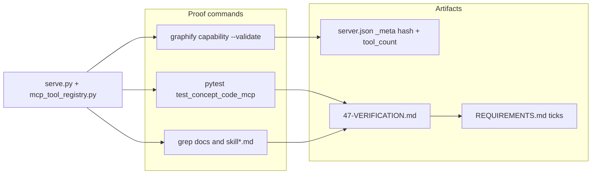

# Phase 51: v1.10-gap-mcp-trace-req-signoff — Research

**Researched:** 2026-04-30  
**Domain:** MCP verification, requirements sign-off (CCODE-03 / CCODE-04), Phase 47 plan closure  
**Confidence:** HIGH (code + docs + CLI verified in repo); MEDIUM (REQUIREMENTS.md wording still unchecked until Phase 51 execution updates it)

<user_constraints>
## User Constraints (from 51-CONTEXT.md)

### Locked Decisions

- **D-51.01:** Author canonical **`47-VERIFICATION.md`** under **`.planning/phases/47-mcp-trace-integration/`** (same pattern as **`45-VERIFICATION.md`** / Phase **50**). Evidence must cite **`pytest`** (including **`tests/test_concept_code_mcp.py`**), grep anchors for **`concept_code_hops`** in **`mcp_tool_registry.py`** / **`serve.py`**, and manifest/doc parity checks from **47-02**.
- **D-51.02:** **CCODE-03** sign-off requires **at least one** MCP tool traversing concept↔implementation edges — satisfied by shipped **`concept_code_hops`** + registry/meta rows once verified against **`capability_tool_meta.yaml`** and regenerated **`server.json`** per **D-47.01**.
- **D-51.03:** **CCODE-04** — REQ text allows **`/trace` OR `entity_trace`**. **Locked interpretation for gap closure:** automated golden-path **`implements`** traversal is proven by **`test_concept_code_hops_golden_path`** calling **`_run_concept_code_hops`**. **`entity_trace`** (`_run_entity_trace`) remains **temporal snapshot** tracing — it does **not** satisfy the typed hop requirement alone. **`/trace`** in **`skill.md`** documents **temporal** tracing aligned with **`entity_trace`**; **concept↔code** hops are **`concept_code_hops`** (skill text already cross-references). **`47-VERIFICATION.md`** must state this mapping explicitly so audit reconciles REQ wording without implying **`entity_trace`** was mislabeled as concept hops.
- **D-51.04:** Phase **51** **wraps** Phase **47** execution debt: before ticking CCODE rows, confirm **47-02** deliverables (**`docs/RELATIONS.md`**, **`docs/ARCHITECTURE.md`** grep targets, **`server.json`** regen + hash, all **`skill*.md`** enumerations) via plan acceptance criteria — partial completion must be recorded under **Gaps** in **`47-VERIFICATION.md`**, not silent drift.

### Claude's Discretion

- Exact **`server.json`** regeneration command and CI vs local **MCP** extra — follow **`CLAUDE.md`** / **`graphify capability`** patterns already used in Phase **24–25** manifest work.
- If **`server.json`** in repo lacks embedded **`concept_code_hops`** string after regen, treat as **blocking** for REQ tick until export pipeline is run and committed (do not fake verification).

### Deferred Ideas (OUT OF SCOPE)

- **Rename `entity_trace`** or unify slash **`/trace`** UX — explicitly deferred in **47-CONTEXT.md**; not reopened unless product requests a dedicated slash for **`concept_code_hops`**.

</user_constraints>

<phase_requirements>
## Phase Requirements

| ID | Description | Research support |
|----|-------------|-------------------|
| **CCODE-03** | At least one MCP tool or structured query path lists or traverses concept↔implementation edges; capability/manifest/skill docs updated if surface area changes. | **`concept_code_hops`** in `build_mcp_tools()` [VERIFIED: `graphify/mcp_tool_registry.py`]; handler **`_tool_concept_code_hops`** + **`_run_concept_code_hops`** [VERIFIED: `graphify/serve.py`]; meta row [VERIFIED: `graphify/capability_tool_meta.yaml`]; docs [VERIFIED: `docs/RELATIONS.md`, `docs/ARCHITECTURE.md`]; manifest drift gate **`python -m graphify capability --validate`** exit 0 [VERIFIED: local run 2026-04-30]. |
| **CCODE-04** | `/trace` (slash) **or** `entity_trace` MCP uses typed concept↔code hops in at least one golden-path scenario with automated coverage. | Per **D-51.03**, typed hops are proven by **`pytest tests/test_concept_code_mcp.py::test_concept_code_hops_golden_path`** (calls **`_run_concept_code_hops`**, asserts `implements` reachability) [VERIFIED: test run]. Slash **`/trace`** + **`entity_trace`** = temporal narrative; **`47-VERIFICATION.md`** must document REQ ↔ implementation mapping. |

</phase_requirements>

## Summary

Phase **51** is a **verification and documentation sign-off** phase: it does not need new traversal logic if Phase **47** code is already merged. Research confirms **`concept_code_hops`** is wired end-to-end (registry, serve handlers, YAML meta, tests, primary skills, architecture docs). **`pytest tests/test_concept_code_mcp.py`** passes and exercises an **`implements`** edge from code → concept with structured meta [VERIFIED: `pytest tests/test_concept_code_mcp.py -q`].

**CCODE-03** closure is demonstrated by: (1) a named MCP tool that walks **`implements`** only, (2) parity of **`capability_tool_meta.yaml`** and committed **`server.json`** metadata with the live manifest builder — use **`graphify capability --validate`**, not a naive **`grep concept_code_hops server.json`**, because the committed **`server.json`** is a **slim transport schema** (no inline tool schemas); **`manifest_content_hash`** / **`tool_count`** carry the contract [VERIFIED: `server.json` contents; `graphify/capability.py` `validate_cli`; `python -m graphify capability --validate` exit 0].

**CCODE-04** closure per **51-CONTEXT** is satisfied by the golden-path test + explicit mapping in **`47-VERIFICATION.md`**: REQ wording still mentions **`/trace` OR `entity_trace`** for “typed hops,” but **`entity_trace`** is temporal; the audited interpretation locks typed **`implements`** hops to **`concept_code_hops`** [CITED: `.planning/phases/51-v1.10-gap-mcp-trace-req-signoff/51-CONTEXT.md` D-51.03].

**Primary recommendation:** Author **`47-VERIFICATION.md`** mirroring **`45-VERIFICATION.md`**, then tick **CCODE-03/04** in **`REQUIREMENTS.md`** only after recording commands, commit SHA, and any **Gaps** (e.g. **`skill-excalidraw.md`** intentionally without **`concept_code_hops`** substring per **47-02-03**).

## Architectural Responsibility Map

| Capability | Primary tier | Secondary tier | Rationale |
|------------|--------------|------------------|-----------|
| **`implements` graph traversal** | API / backend (`serve.py` on loaded `nx.Graph`) | — | Pure graph logic + MCP stdio boundary |
| **MCP tool schema & examples** | API / backend (`mcp_tool_registry.py` + handler docstrings) | — | Co-owned manifest inputs per **D-47.01** |
| **Committed MCP manifest (`server.json`)** | Repo config / release artifact | CI / local `graphify capability` | Hash + tool_count gate consumers |
| **Agent-facing slash + tool lists** | Documentation (`graphify/skill*.md`) | — | Narrative routing; no runtime enforcement |

## Standard Stack

### Core

| Component | Version / pin | Purpose | Why standard |
|-----------|----------------|---------|----------------|
| **Python** | 3.10+ (CI: 3.10, 3.12 per `CLAUDE.md`) | Tests + CLI | Project baseline |
| **pytest** | via `pyproject.toml` / CI | Automated proof for CCODE-04 | Required gate |
| **graphify MCP extras** | `pip install -e ".[mcp,pdf,watch]"` [CITED: `CLAUDE.md`] | PyYAML + `jsonschema` for `capability` | `validate_cli` imports |

### Supporting

| Component | Purpose | When to use |
|-----------|---------|-------------|
| **`python -m graphify capability --validate`** | Compares built manifest to **`server.json`** `_meta` | Before REQ tick; after any tool/schema change |
| **`python -m graphify capability --stdout > server.json`** | Regenerates committed slim manifest + `_meta` | After tool list or version bump [CITED: `server.json` `_meta.regenerate_command`] |

### Alternatives considered

| Instead of | Could use | Tradeoff |
|------------|-----------|----------|
| **`grep concept_code_hops server.json`** | **`capability --validate`** | Slim **`server.json`** may never contain the substring; false “stale” signal [VERIFIED: `server.json` has no tool names]. |

**Regeneration (from repo root):** [CITED: `CLAUDE.md` + `server.json`]

```bash
pip install -e ".[mcp,pdf,watch]"
python -m graphify capability --validate
# If validate fails after edits:
python -m graphify capability --stdout > server.json
pytest tests/ -q
```

## Architecture Patterns

### System architecture (verification flow)



### Recommended evidence layout (in `47-VERIFICATION.md`)

Mirror **`45-VERIFICATION.md`**: frontmatter (`status`, `phase`, `verified` date), **Must-haves** table mapping REQ/decisions → evidence, **Evidence details (grep anchors)** with representative paths, **Automated** fenced outputs, **Gaps**, optional **human_verification** [VERIFIED: `.planning/phases/45-baselines-detect-self-ingestion/45-VERIFICATION.md` structure].

### Anti-patterns

- **Ticking REQs without `47-VERIFICATION.md`:** violates **D-51.01** / traceability table in **`REQUIREMENTS.md`** [CITED: `.planning/REQUIREMENTS.md`].
- **Claiming `entity_trace` satisfies typed hops:** contradicts **D-51.03** and Phase **47** research [CITED: `.planning/phases/47-mcp-trace-integration/47-RESEARCH.md`].
- **Relying on substring search in `server.json` alone:** misleading for slim manifest; prefer **`capability --validate`** [VERIFIED: `graphify/capability.py` `validate_cli`].

## Gap checklist: 47-02 plan vs repository (2026-04-30)

| 47-02 task / acceptance | Expected signal | Repo status | Notes |
|-------------------------|-----------------|-------------|-------|
| **47-02-01** `grep concept_code_hops docs/RELATIONS.md` | exit 0 | **Met** [VERIFIED: grep] | Table row documents `implements` traversal |
| **47-02-01** `grep concept_code_hops docs/ARCHITECTURE.md` | exit 0 | **Met** [VERIFIED: grep] | `serve.py` paragraph references tool |
| **47-02-02** `manifest_content_hash` in `server.json` | present | **Met** [VERIFIED: `server.json`] | |
| **47-02-02** `tool_count` matches `len(build_mcp_tools())` | equal | **Met** [VERIFIED: python → 27; `_meta.tool_count` 27] | |
| **47-02-02** `graphify capability --validate` | exit 0 | **Met** [VERIFIED: local run] | |
| **47-02-03** each listed `skill-*.md` contains `concept_code_hops` **or** updated tool table | substring ≥1 | **Partial** | **`skill-excalidraw.md`:** 0 matches [VERIFIED: `grep -c`]. **47-02-PLAN** allows skip if no MCP enumeration block; file has MCP for seeds, not global tool list — record under **Gaps** in **`47-VERIFICATION.md`** with rationale [CITED: `.planning/phases/47-mcp-trace-integration/47-02-PLAN.md` task 47-02-03]. |
| **47-02-03** `grep -n /trace graphify/skill.md` references concept↔code hop | line points to `concept_code_hops` | **Met** [VERIFIED: `skill.md` L122] | |

## Recommended `47-VERIFICATION.md` outline

1. **YAML frontmatter** — `status: passed` (when true), `phase: 47`, `phase_name`, `verified: YYYY-MM-DD`.
2. **Purpose** — One paragraph: close **CCODE-03** / **CCODE-04** via Phase **47** delivery + **D-51.03** REQ wording mapping.
3. **REQ mapping (audit table)**

   | REQ | What must be true | Proof |
   |-----|-------------------|--------|
   | **CCODE-03** | MCP traverses concept↔implementation via **`implements`** | Tool name in `build_mcp_tools()`; `_handlers`; `capability_tool_meta.yaml`; **`capability --validate`** |
   | **CCODE-04** | Golden-path automated typed hops | `pytest …::test_concept_code_hops_golden_path` |
   | **CCODE-04 (wording)** | `/trace` / `entity_trace` vs typed hops | Quote **`skill.md`** `/trace` bullet + state **`entity_trace`** temporal; typed hops = **`concept_code_hops`** |

4. **Must-haves vs D-47.01–03** — Bullet list aligned with **47-01** / **47-02** `must_haves` frontmatter.
5. **Evidence details (grep anchors)** — Example `rg` / `grep -n` lines for `concept_code_hops` in `mcp_tool_registry.py`, `serve.py` (`_run_concept_code_hops`, `_tool_concept_code_hops`), `capability_tool_meta.yaml`, `docs/RELATIONS.md`, `docs/ARCHITECTURE.md`, `skill.md` (and note platform variants if spot-checked).
6. **Automated** — Fenced output for:
   - `pytest tests/test_concept_code_mcp.py -q`
   - `python -c "from graphify.mcp_tool_registry import build_mcp_tools; assert any(t.name=='concept_code_hops' for t in build_mcp_tools())"`
   - `python -m graphify capability --validate`
   - Optional slice: `pytest tests/test_capability.py -q` [ASSUMED: if planners want manifest unit coverage cited]
7. **`server.json` / manifest note** — Document that committed file is **slim**; parity = **`_meta.manifest_content_hash`** + **`tool_count`**, verified by **`capability --validate`** (not substring of tool name in `server.json`).
8. **Gaps** — e.g. **`skill-excalidraw.md`** exclusion per **47-02-03**; any version skew (**`server.json` `version`** vs `package_version()`) if material.
9. **Commit** — `git rev-parse --short HEAD` at verification time.

## Pytest / grep evidence map (closure commands)

| Claim | Command / location | Role |
|-------|----------------------|------|
| Golden-path typed hops | `pytest tests/test_concept_code_mcp.py::test_concept_code_hops_golden_path -q` | **CCODE-04** automated proof [VERIFIED: pass] |
| Full MCP test file | `pytest tests/test_concept_code_mcp.py -q` | **47-01-02** acceptance [VERIFIED: pass] |
| Tool registered | `python -c "from graphify.mcp_tool_registry import build_mcp_tools; assert any(t.name=='concept_code_hops' for t in build_mcp_tools())"` | **47-01-01** [CITED: `47-01-PLAN.md`] |
| Registry anchor | `grep -n concept_code_hops graphify/mcp_tool_registry.py` | **47-01-01** |
| Serve helper anchor | `grep -n _run_concept_code_hops graphify/serve.py` | **47-01-01** |
| YAML meta anchor | `grep -n concept_code_hops graphify/capability_tool_meta.yaml` | **D-47.01** |
| Docs | `grep -n concept_code_hops docs/RELATIONS.md docs/ARCHITECTURE.md` | **47-02-01** |
| Skill routing | `grep -n "/trace" graphify/skill.md` and `grep -n concept_code_hops graphify/skill.md` | **47-02-03** + **D-51.03** |
| Manifest parity | `python -m graphify capability --validate` | **D-47.01** / **D-51.02** (preferred over raw `server.json` grep) |

## Common pitfalls

### Pitfall 1: “Stale `server.json`” from missing substring

**What goes wrong:** Someone greps **`server.json`** for **`concept_code_hops`**, finds nothing, declares manifest broken.  
**Why:** Slim **`server.json`** stores package transport + **`_meta`** only; full tool schemas live in the **built** manifest compared by **`validate_cli`** [VERIFIED: `server.json`; `capability.py`].  
**How to avoid:** Run **`python -m graphify capability --validate`**; if failure, regen per **`_meta.regenerate_command`**.  
**Warning signs:** False blocking on **D-51.02** when **`tool_count`** and hash already match.

### Pitfall 2: Over-reading **CCODE-04** as “`entity_trace` must walk `implements`”

**What goes wrong:** Audit assumes **`entity_trace`** must appear in the golden-path test.  
**Why:** Locked Phase **51** interpretation separates temporal vs typed hops [CITED: `51-CONTEXT.md` D-51.03].  
**How to avoid:** **`47-VERIFICATION.md`** opens with explicit REQ ↔ tool mapping.  
**Warning signs:** Tests added to **`entity_trace`** that duplicate **`concept_code_hops`** (out of scope per deferred items).

### Pitfall 3: Silent partial skill parity

**What goes wrong:** All primary skills updated but **`skill-excalidraw.md`** never mentioned in verification.  
**Why:** **47-02-03** allows conditional skip.  
**How to avoid:** List excluded files under **Gaps** with rationale [CITED: `47-02-PLAN.md`].  
**Warning signs:** Future contributor adds MCP enumeration to excalidraw skill without syncing tool list.

## Code examples

### Golden-path test (canonical CCODE-04 proof)

```python
# Source: tests/test_concept_code_mcp.py [VERIFIED: file contents]
# pytest: tests/test_concept_code_mcp.py::test_concept_code_hops_golden_path
```

(Planner: cite full test in **`47-VERIFICATION.md`** Automated section — avoids duplication drift.)

## State of the art

| Old approach | Current approach | Impact |
|--------------|------------------|--------|
| Expect full tool JSON inside **`server.json`** | Slim **`server.json`** + **`manifest_content_hash`** | Validation command changes |
| Satisfy **CCODE-04** only via **`entity_trace`** | Dedicated **`concept_code_hops`** + documented `/trace` split | Clearer agent semantics [CITED: `47-RESEARCH.md`] |

**Deprecated / outdated:** Using **`grep concept_code_hops server.json`** as the sole manifest check — superseded by **`capability --validate`** for this repo layout [VERIFIED].

## Assumptions log

| # | Claim | Section | Risk if wrong |
|---|-------|---------|----------------|
| A1 | **`skill-excalidraw.md`** omission is acceptable without updating file | Gap checklist | Product may later require full enumeration parity |
| A2 | **`python -m graphify capability --validate`** from repo root is sufficient for CI parity | Standard stack | CI could use different cwd or missing extras |

**If empty:** N/A — table lists assumptions.

## Open questions

1. **Should `REQUIREMENTS.md` CCODE-04 text be edited in Phase 51?**
   - **What we know:** Traceability ties **51** → **47**; **D-51.03** locks interpretation [CITED: `51-CONTEXT.md`].
   - **What’s unclear:** Whether milestone policy requires literal REQ edit vs verification-only mapping.
   - **Recommendation:** Planner decides; minimally, **`47-VERIFICATION.md`** + optional **`REQUIREMENTS.md`** footnote row.

2. **`server.json` `version` / PyPI identifier vs `package_version()` mismatch**
   - **What we know:** **`server.json`** shows **`1.0.0`** [VERIFIED: read file].
   - **What’s unclear:** Whether release process requires bump before REQ tick.
   - **Recommendation:** Out of scope for CCODE unless **D-47.01** explicitly ties version fields; note in **Gaps** if drift is observed.

## Environment availability

| Dependency | Required by | Available | Version / outcome | Fallback |
|------------|-------------|-----------|---------------------|----------|
| Python 3.x | pytest, graphify | ✓ | 3.x on research host | — |
| Editable install `[mcp]` | `capability` (PyYAML) | ✓ | `capability --validate` exit 0 | Document `pip install -e ".[mcp,pdf,watch]"` in **`47-VERIFICATION.md`** |

**Missing with no fallback:** None for research host.

## Validation Architecture

> **`workflow.nyquist_validation`** is **true** in `.planning/config.json` [VERIFIED].

### Test framework

| Property | Value |
|----------|-------|
| Framework | pytest (project standard) [CITED: `CLAUDE.md`] |
| Config file | none dedicated — see `pyproject.toml` / CI |
| Quick run (CCODE slice) | `pytest tests/test_concept_code_mcp.py -q` |
| Full suite gate | `pytest tests/ -q` [CITED: `CLAUDE.md`] |

### Phase requirements → test map

| Req ID | Behavior | Test type | Automated command | File |
|--------|----------|------------|---------------------|------|
| **CCODE-03** | Tool exists and is part of MCP surface | unit + manifest | `python -c "…build_mcp_tools…"` + `python -m graphify capability --validate` | `tests/test_capability.py` (manifest validation patterns) |
| **CCODE-04** | Typed **`implements`** hops on built graph | unit | `pytest tests/test_concept_code_mcp.py::test_concept_code_hops_golden_path -q` | `tests/test_concept_code_mcp.py` ✅ |

### Manifest regen (Nyquist / release hygiene)

| Step | Command | When |
|------|---------|------|
| Validate | `python -m graphify capability --validate` | Per wave / before REQ tick |
| Regenerate | `python -m graphify capability --stdout > server.json` | After tool schema, examples, or version policy changes |
| Post-bump (releases) | `python scripts/sync_mcp_server_json.py` [CITED: `CLAUDE.md`] | PyPI-facing releases |

### Sampling rate

- **Per task commit:** `pytest tests/test_concept_code_mcp.py -q` + `python -m graphify capability --validate`
- **Phase gate:** `pytest tests/ -q` green before **`/gsd-verify-work`**

### Wave 0 gaps

None blocking — **`tests/test_concept_code_mcp.py`** exists and passes [VERIFIED]. Optional: add a **`test_capability.py`** assertion that built manifest tool names include **`concept_code_hops`** if planners want redundant CI signal [ASSUMED].

## Security domain

| Applicable ASVS-style concern | Applies? | Note |
|-------------------------------|------------|------|
| V5 Input validation | Yes | **`concept_code_hops`** reuses graph tool validation / bounded hops per **47-01** threat model [CITED: `47-01-PLAN.md`] |
| V2 / V3 / V4 / V6 | No / minimal | Phase **51** is verification-only; no new auth/session/crypto |

## Project constraints (from `.cursor/rules/`)

No **`.cursor/rules/`** directory found in the repo root [VERIFIED: glob]. Continue to follow **`CLAUDE.md`** and workspace **`CLAUDE.md`** embedded rules.

## Sources

### Primary (HIGH)

- [VERIFIED: workspace] `tests/test_concept_code_mcp.py`, `graphify/serve.py`, `graphify/mcp_tool_registry.py`, `graphify/capability_tool_meta.yaml`, `server.json`, `graphify/capability.py` (`validate_cli`)
- [VERIFIED: shell] `pytest tests/test_concept_code_mcp.py -q`, `python -m graphify capability --validate`, `python -c "…build_mcp_tools…"`
- [CITED: `.planning/phases/51-v1.10-gap-mcp-trace-req-signoff/51-CONTEXT.md`]
- [CITED: `.planning/phases/47-mcp-trace-integration/47-01-PLAN.md`, `47-02-PLAN.md`]
- [CITED: `.planning/REQUIREMENTS.md`]
- [CITED: `CLAUDE.md`]

### Secondary (MEDIUM)

- [CITED: `.planning/phases/45-baselines-detect-self-ingestion/45-VERIFICATION.md`] — template pattern

## Metadata

**Confidence breakdown:**

- Standard stack: **HIGH** — Python/pytest/capability CLI verified locally  
- Architecture: **HIGH** — matches implemented `serve` + slim `server.json` model  
- Pitfalls: **HIGH** — derived from actual `server.json` shape + `validate_cli` behavior  

**Research date:** 2026-04-30  
**Valid until:** ~30 days (manifest schema stable) unless MCP tool list changes

---

## RESEARCH COMPLETE

**Phase:** 51 — v1.10-gap-mcp-trace-req-signoff  
**Confidence:** HIGH

### Key findings

1. **CCODE-03** is provable via **`concept_code_hops`** + registry + YAML + **`capability --validate`** (not **`grep` inside `server.json`**).  
2. **CCODE-04** typed-hop proof is **`test_concept_code_hops_golden_path`**; **`/trace` / `entity_trace`** are temporal — document in **`47-VERIFICATION.md`** per **D-51.03**.  
3. **47-02** is effectively complete except documenting **`skill-excalidraw.md`** as an intentional partial.  
4. **`47-VERIFICATION.md`** should follow **`45-VERIFICATION.md`** with explicit REQ mapping and automated fenced outputs.

### File created

`.planning/phases/51-v1.10-gap-mcp-trace-req-signoff/51-RESEARCH.md`

### Confidence assessment

| Area | Level | Reason |
|------|-------|--------|
| Standard stack | HIGH | Local pytest + validate succeeded |
| Architecture | HIGH | Code and `server.json` format inspected |
| Pitfalls | HIGH | False-negative `grep` risk confirmed |

### Open questions

See **Open questions** — REQ literal edit vs verification-only mapping; optional version field alignment.

### Ready for planning

Research complete. Planner can create **`47-VERIFICATION.md`** and Phase **51** execution plan tasks.
